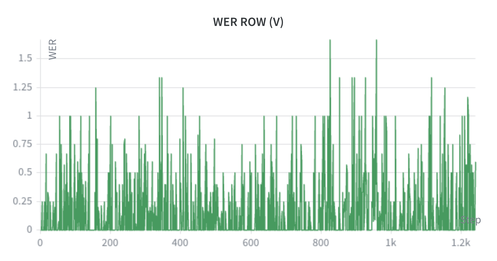
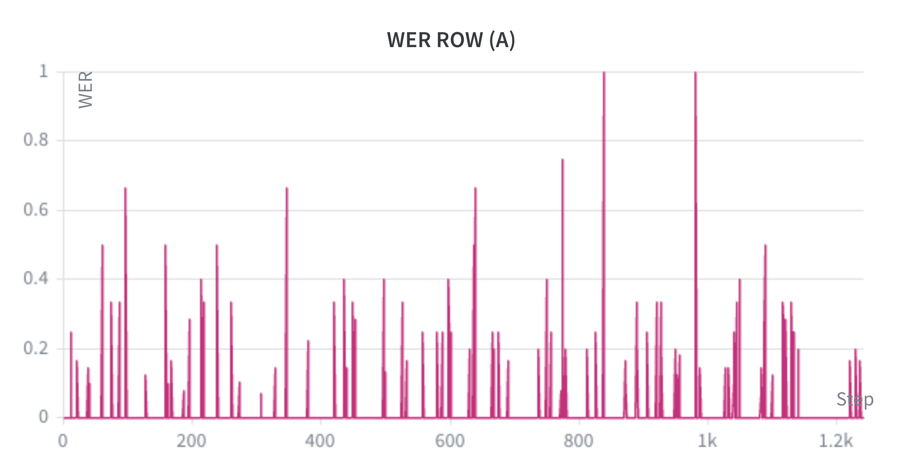
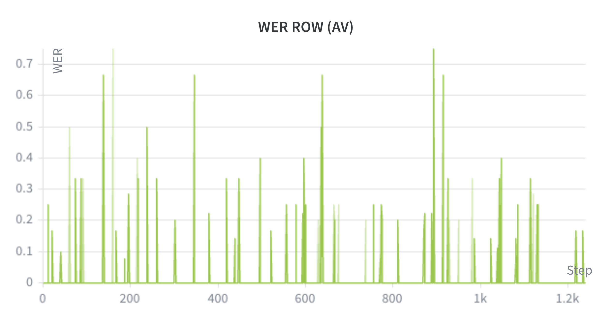

# Testing USR 2.0 on LRS2 Test Set 

  

USR 2.0 is a framework created by <a href="https://arxiv.org/abs/2602.19316">Haliassos et al.</a> that uses self-supervised pretraining followed by semi-supervised fine-tuning. This framework unified audio and video input modalities for speech recognition and also allowed for single-modalities (audio-only or video-only) to be used at inference time. The original paper demonstrated strong performance training using LRS2, LRS3, VoxCeleb2, and AVSpeech datasets. Even though the model train using LRS2 dataset, The csv file <a href="https://drive.google.com/file/d/1DX4Afk_yn5fMgWHPEMilZotRLBfCu1cU/view?usp=sharing">test.csv</a> does not contained original test set of <a href="https://www.robots.ox.ac.uk/~vgg/data/lip_reading/lrs2.html">LRS2</a> dataset. This repository only reports the inference result on that test set using audio-only modality, visual-only modality, and audio-visual modalities.   

# LRS2 Test Set Results
This dataset contains 1243 utterances spoken in English in video format. First, the repository uses [mediapipe](https://ai.google.dev/edge/mediapipe/solutions/guide) or [retinaface](https://github.com/hhj1897/face_alignment.git) to detect face and extract the lip region. From 1243 videos, 2 videos were not able to be processed due to face-angle and only half-face visibility. In results, the visual-only and audio-visual modalities only cover 1241 utterances while audio-only modality covers all 1243 utterances. 

The test run utilizes original author fine-tuned checkpoint huge high resource and backbone config resnet_transfomer_huge. The Word Error Rate (WER) results are as follows:
| Modality | WER (%) | Utterances Processed |
|----------|---------|----------------------|
| Visual-only (V) | 13.39% | 1241 |
| Audio-only (A) | 1.79% | 1243 |
| Audio-Visual (AV) | 1.31% | 1241 |
| | | |

Following are example of biggest WER error cases for each modality (V/A/AV) that were observed during the test run and comparison of other modalities:

Visual-only modality biggest WER error 166.7% on index 826 and 957 

| Index | Text Reference | Visual-only (V) | Audio-only (A) | Audio-Visual (AV) |
|-------|----------------|-----------------|----------------|-------------------|
| 826   | IN THIS COUNTRY | i think it sounds right | in this country | in this country |
| 957   | BECAUSE THE EMPIRE | being asked to come back | because the empire | because the empire |
| | | | | |

  

Audio-only modality biggest WER error 100% on index 838 and 981

| Index | Text Reference | Visual-only (V) | Audio-only (A) | Audio-Visual (AV) |
|-------|----------------|-----------------|----------------|-------------------|
| 838   | AND LET'S FACE IT | let's face it | from their space | and let's face it |
| 981   | THEY KEPT LIVING | they kept leaving | they kept leaving i think | they kept leaving |
| | | | | 

  

Audio-Visual modality biggest WER error 75% on index 158 and 893 

| Index | Text Reference | Visual-only (V) | Audio-only (A) | Audio-Visual (AV) |
|-------|----------------|-----------------|----------------|-------------------|
| 158   | BUT THE WALDORF ASTORIA | the war of the story | but the ward off astoria | but the ward off historia |
| 894   | PLAYED BY JIM BROADBENT | played by timber or maiden | played by jim broadbent | played by jimbo or bent |
| | | | | 

  

