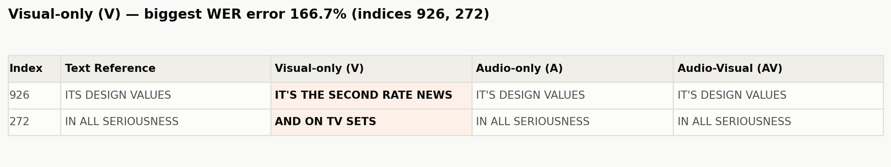
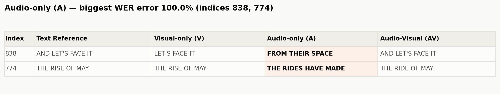
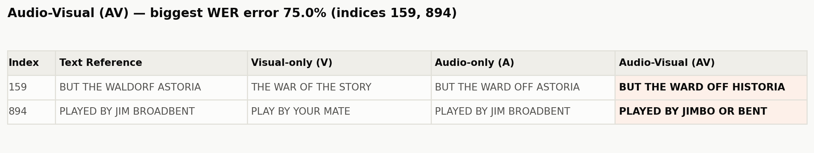

# Testing USR 2.0 on LRS2 Test Set

<p align="center">
  
</p>

USR 2.0 is a framework created by [Haliassos et al.](https://arxiv.org/abs/2602.19316) that uses self-supervised pretraining followed by semi-supervised fine-tuning. This framework unifies audio and video input modalities for speech recognition and also allows single modalities (audio-only or video-only) to be used at inference time. The original paper demonstrated strong performance training using LRS2, LRS3, VoxCeleb2, and AVSpeech datasets. Even though the model was trained using the LRS2 dataset, the published [test.csv](https://drive.google.com/file/d/1DX4Afk_yn5fMgWHPEMilZotRLBfCu1cU/view?usp=sharing) does not contain the original [LRS2](https://www.robots.ox.ac.uk/~vgg/data/lip_reading/lrs2.html) test set. This repository reports inference results on that test set using audio-only, visual-only, and audio-visual modalities — both in clean (no-noise) conditions and under a full SNR noise-robustness sweep.

**Workflow covered by this README**: [Setup](#setup) → [Prepare the test manifest](#test-data) → [Run evaluation](#running-evaluation) → [Clean-condition results](#clean-condition-results) → [Noise-robustness results](#noise-robustness-results).

---

## Setup

Prerequisites: Python 3.8+, this repo's `requirements.txt`, and (optional but recommended) a CUDA GPU.

```bash
python -m venv .venv
source .venv/bin/activate        # csh: source .venv/bin/activate.csh
pip install -r requirements.txt
```

**Audio backend**: `torchaudio` needs a working backend to read `.wav` files. If `python -c "import torchaudio; print(torchaudio.list_audio_backends())"` prints `[]`, install `soundfile` (`pip install soundfile` — it bundles `libsndfile` and needs no system ffmpeg):

```bash
pip install soundfile
```

**GPU visibility** — pin a run to one GPU with `CUDA_VISIBLE_DEVICES`:
```bash
export CUDA_VISIBLE_DEVICES=0     # csh: setenv CUDA_VISIBLE_DEVICES 0
```

**Long-running evaluations**: run them inside `tmux` so they survive a disconnected session, e.g. `tmux new -s eval "CUDA_VISIBLE_DEVICES=0 .venv/bin/python scripts/run_noise_eval.py ..."`. Two GPUs can run independent modality subsets in parallel this way — see [Running Evaluation](#running-evaluation).

---

## Test Data

This dataset contains 1243 English utterances in video format. Face detection and lip-region extraction use [MediaPipe](https://ai.google.dev/edge/mediapipe/solutions/guide) (or [RetinaFace](https://github.com/hhj1897/face_alignment.git)). Of the 1243 videos, **2 fail face detection** (extreme face angle / only half the face visible) — audio-only decoding still works fine for them, but visual-only and audio-visual do not.

- `csv/lrs2_test_modified.csv` — the full 1243-row manifest (`dataset, video_path, audio_path, true_text, status, prediction_text, wer`).
- `csv/lrs2_test_1241.csv` — the same manifest with those 2 problem utterances pre-filtered out, generated by `scripts/make_filtered_test_csv.py`. Use this one so `a`/`v`/`av` all evaluate the identical utterance set (no per-modality error-row bookkeeping needed).

```bash
python scripts/make_filtered_test_csv.py   # csv/lrs2_test_modified.csv -> csv/lrs2_test_1241.csv
```

---

## Running Evaluation

### Recommended: standalone driver script (batch / tmux / multi-GPU)

`scripts/run_noise_eval.py` loads the model once, reuses it across every row/modality/SNR level, and writes per-utterance report CSVs plus a summary CSV — no notebook required.

```bash
# Quick smoke test — 10 rows, all 3 modalities, no noise
.venv/bin/python scripts/run_noise_eval.py \
  csv_path=csv/lrs2_test_1241.csv "modality='a,v,av'" max_rows=10 "snr_levels='inf'"

# Full clean-condition run
.venv/bin/python scripts/run_noise_eval.py \
  csv_path=csv/lrs2_test_1241.csv "modality='a,v,av'" "snr_levels='inf'" \
  decode.beam_size=30 decode.ctc_weight=0.1 decode.maxlenratio=0.4

# Full noise-robustness sweep, split across 2 GPUs (a+v on GPU0, av on GPU1)
CUDA_VISIBLE_DEVICES=0 .venv/bin/python scripts/run_noise_eval.py \
  csv_path=csv/lrs2_test_1241.csv "modality='a,v'" \
  "snr_levels='inf,30,25,20,15,10,5,0,-5,-10'" \
  decode.beam_size=30 decode.ctc_weight=0.1 decode.maxlenratio=0.4 \
  noise_path=data/noise/babble_noise.npy seed=42 out_dir=csv/sweep_gpu0

CUDA_VISIBLE_DEVICES=1 .venv/bin/python scripts/run_noise_eval.py \
  csv_path=csv/lrs2_test_1241.csv "modality='av'" \
  "snr_levels='inf,30,25,20,15,10,5,0,-5,-10'" \
  decode.beam_size=30 decode.ctc_weight=0.1 decode.maxlenratio=0.4 \
  noise_path=data/noise/babble_noise.npy seed=42 out_dir=csv/sweep_gpu1
```

Key overrides: `modality` (`a`, `v`, `av`, comma-separated), `snr_levels` (`inf` = no noise, or comma-separated dB values, including negative), `max_rows` (`-1` = all rows), `seed` (default `42`, makes the noise-crop selection reproducible), `decode.beam_size` / `decode.ctc_weight` / `decode.maxlenratio` (`beam_size=1 ctc_weight=0.0` for a fast greedy smoke test; `beam_size=30 ctc_weight=0.1 maxlenratio=0.4` for paper-faithful numbers), `out_dir` (report/summary output directory).

If `snr_levels` includes real dB values, first build a noise source (a local babble-noise stand-in, since the paper's own babble noise file isn't distributed):
```bash
python scripts/make_babble_noise.py   # writes data/noise/babble_noise.npy
```

### Alternative: interactive notebook

`inference_test_data.ipynb` runs the same evaluation cell-by-cell (useful for inspecting individual predictions or re-running specific error rows). Full cell-order walkthrough, smoke-test instructions, and troubleshooting: **[README_inference_test_data.md](README_inference_test_data.md)**.

### After a run

- Merge multi-GPU summaries and aggregate: `csv/noise_sweep_summary.csv` (`modality, snr_db, num_ok, num_error, corpus_wer` — one row per modality × SNR combo; this is the only run output kept in the repo — per-utterance report CSVs are regenerated on demand, not committed).
- Per-utterance predictions: written to `csv/[report]{modality}_noise_{level}_*.csv` (`out_dir=...` puts split multi-GPU runs under separate subdirectories) — regenerate by re-running the commands above.
- Regenerate the results table and chart any time from `csv/noise_sweep_summary.csv`:
  ```bash
  python scripts/make_report_md.py     # writes reports.md
  python scripts/plot_wer_vs_snr.py    # writes wer_vs_snr.png
  ```

---

## Clean-Condition Results

The results below use the original author fine-tuned checkpoint (`huge_high_resource`, backbone `resnet_transformer_huge`), decoded with `beam_size=30, ctc_weight=0.1` and no noise added WER performance [noise-robustness sweep](#noise-robustness-results). From 1243 utterances, 2 fail face detection and are filtered out for a fair comparison across all 3 modalities. The remaining 1241 utterances are evaluated and reported in the table below. (`csv/lrs2_test_1241.csv`) 

| Modality | WER (%) | Utterances Processed |
|----------|---------|----------------------|
| Visual-only (V) | 15.48% | 1241 |
| Audio-only (A) | 1.86% | 1241 |
| Audio-Visual (AV) | 1.40% | 1241 |

> Earlier numbers reported here (V 13.39%, A 1.79% on 1243 utterances, AV 1.31%) came from separate runs where audio-only used the full unfiltered 1243-row manifest while visual/audio-visual used the 1241-row filtered one — not a like-for-like comparison. The table above supersedes those.

<details>
<summary><b>Biggest WER error cases per modality</b></summary>

**Visual-only** — biggest WER error 166.7% on index 926 and 272

| Index | Text Reference | Visual-only (V) | Audio-only (A) | Audio-Visual (AV) |
|-------|----------------|-----------------|----------------|-------------------|
| 926   | ITS DESIGN VALUES | it's the second rate news | it's design values | it's design values |
| 272   | IN ALL SERIOUSNESS | and on tv sets | in all seriousness | in all seriousness |

<p align="center"></p>

**Audio-only** — biggest WER error 100% on index 838 and 774

| Index | Text Reference | Visual-only (V) | Audio-only (A) | Audio-Visual (AV) |
|-------|----------------|-----------------|----------------|-------------------|
| 838   | AND LET'S FACE IT | let's face it | from their space | and let's face it |
| 774   | THE RISE OF MAY | the rise of may | the rides have made | the ride of may |

<p align="center"></p>

**Audio-Visual** — biggest WER error 75% on index 159 and 894

| Index | Text Reference | Visual-only (V) | Audio-only (A) | Audio-Visual (AV) |
|-------|----------------|-----------------|----------------|-------------------|
| 159   | BUT THE WALDORF ASTORIA | the war of the story | but the ward off astoria | but the ward off historia |
| 894   | PLAYED BY JIM BROADBENT | play by your mate | played by jim broadbent | played by jimbo or bent |

<p align="center"></p>

> Indices refer to row position (1-based) in `csv/lrs2_test_1241.csv`. Recomputed from the same clean-condition (`inf`) run as the summary table above — regenerate via `scripts/find_worst_wer_examples.py` + `scripts/render_wer_row_tables.py`. This run is also logged to wandb (project `usr2.0`, run `lrs2_1241_clean_inf`) with the full 1241-utterance prediction table.

</details>

---

## Noise-Robustness Results

Same 1241-utterance test set, swept across SNR levels `inf` (no noise), 30, 25, 20, 15, 10, 5, 0, -5, -10 dB with a local babble-noise source (`data/noise/babble_noise.npy`), `beam_size=30, ctc_weight=0.1, maxlenratio=0.4`, `seed=42` for reproducibility.


| Modality | inf | 30dB | 25dB | 20dB | 15dB | 10dB | 5dB | 0dB | -5dB | -10dB |
|---|---|---|---|---|---|---|---|---|---|---|
| Audio (ASR) | 1.86 | 1.67 | 1.65 | 1.67 | 1.95 | 3.22 | 7.80 | 44.75 | 97.05 | 100.00 |
| Visual (VSR) | 15.48 | 15.48 | 15.48 | 15.48 | 15.48 | 15.48 | 15.48 | 15.48 | 15.48 | 15.48 |
| Audio-Visual (AVSR) | 1.40 | 1.35 | 1.32 | 1.29 | 1.47 | 1.50 | 3.29 | 12.45 | 66.65 | 98.38 |

<details>
<summary><b>Reading these numbers</b></summary>

- **Visual (V) is flat by construction** — noise only ever perturbs the audio branch (`utils/inference_.py:transcribe`'s `v` path never touches audio), so its prediction is identical at every SNR level. `run_noise_eval.py` exploits this by decoding each video once and reusing that result across all 10 columns instead of repeating an identical beam search.
- **`inf` vs. 30/25/20dB isn't perfectly monotonic** — at very high SNR the injected noise power is tiny, so a small, fixed set of borderline utterances (~2-3% of the corpus) flip prediction; that's expected sampling behavior from mixing a small amount of noise, not measurement error. The trustworthy signal is the sharp, consistent cliff from 5dB down through -10dB, where AV consistently degrades later and less severely than A alone.
- **One unified model, not three** — `a`/`v`/`av` are three decode-time views of a single jointly-trained checkpoint (`models/huge_high_resource_lrs2lrs3vox2avsp.pth`), not three separately-trained models.

Full methodology, raw per-utterance predictions, and qualitative noisy-audio samples (`data/noise/noise{level}dB/*.wav`, 5 utterances × 9 noise levels): **[reports.md](reports.md)**.

</details>

---

## Scripts Reference

| Script | Purpose |
|---|---|
| `scripts/make_filtered_test_csv.py` | Build the shared 1241-row datapath (filters the 2 face-detection failures). |
| `scripts/make_babble_noise.py` | Build a local babble-noise `.npy` source from the test set's own audio. |
| `scripts/run_noise_eval.py` | Main evaluation driver — modality × SNR grid, model loaded once, tmux/multi-GPU friendly. |
| `scripts/save_noise_samples.py` | Materialize playable noisy `.wav` samples for a few utterances, for manual listening. |
| `scripts/make_report_md.py` | Render `csv/noise_sweep_summary.csv` into `reports.md`. |
| `scripts/plot_wer_vs_snr.py` | Render `csv/noise_sweep_summary.csv` into `wer_vs_snr.png`. |
| `scripts/find_worst_wer_examples.py` | Join the per-modality clean-condition reports and find the worst-WER utterances. |
| `scripts/render_wer_row_tables.py` | Render those worst-case examples into `assets/WER_ROW_(V/A/AV).png`. |
| `scripts/log_wandb_run.py` | Log a clean-condition run's predictions + worst-case tables to wandb. |
