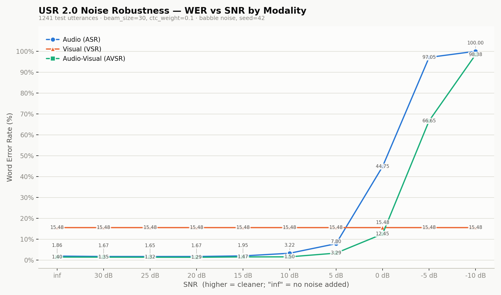

# USR 2.0 — Noise-Robustness Grid

Word Error Rate (%) across 1241 test utterances (`csv/lrs2_test_1241.csv` — the 1243-row `csv/lrs2_test_modified.csv` test set with 2 face-detection-failure utterances pre-filtered out) for every modality x SNR combination.

## Results

| Modality | inf | 30dB | 25dB | 20dB | 15dB | 10dB | 5dB | 0dB | -5dB | -10dB |
|---|---|---|---|---|---|---|---|---|---|---|
| Audio (ASR) | 1.86 | 1.67 | 1.65 | 1.67 | 1.95 | 3.22 | 7.80 | 44.75 | 97.05 | 100.00 |
| Visual (VSR) | 15.48 | 15.48 | 15.48 | 15.48 | 15.48 | 15.48 | 15.48 | 15.48 | 15.48 | 15.48 |
| Audio-Visual (AVSR) | 1.40 | 1.35 | 1.32 | 1.29 | 1.47 | 1.50 | 3.29 | 12.45 | 66.65 | 98.38 |

## Methodology

- **SNR schedule**: `inf` (no noise) then 30, 25, 20, 15, 10, 5, 0, -5, -10 dB. `inf` is a sentinel meaning no noise is mixed in at all (not a very-high-dB point) — see `data/transforms.py:AddNoise` (snr_target=9999) and `scripts/run_noise_eval.py:parse_snr_levels`.
- **Noise source**: `data/noise/babble_noise.npy`, a synthetic babble track built from 10 randomly-chosen local speakers (`scripts/make_babble_noise.py`) since the paper's own babble noise file isn't available in this environment.
- **Decode settings**: `decode.beam_size=30`, `decode.ctc_weight=0.1`, `decode.maxlenratio=0.4` — matches the exact settings `README.md` uses for its own published noise-robustness table.
- **Reproducibility**: `scripts/run_noise_eval.py` seeds Python's global `random` module once (`seed=42` by default) before the sweep, since `AddNoise`'s noise-crop position is otherwise drawn from unseeded global state. Re-running with the same seed reproduces this table exactly. Note this makes the run reproducible, not perfectly monotonic: at very high SNR (30/25/20dB) the injected noise power is tiny, so a small, fixed set of borderline utterances (~2-3% of the corpus) flip prediction — WER at 25dB/20dB can come out marginally lower than at `inf` for exactly this reason. That's expected sampling behavior from mixing a small amount of noise, not an error. The trustworthy signal is the sharp, consistent cliff from 5dB down through -10dB.
- **Visual (v) row**: architecturally noise-invariant — noise only ever perturbs the audio branch (`utils/inference_.py:transcribe`'s `v` path never touches audio at all). `scripts/run_noise_eval.py` exploits this by decoding each utterance's video **once** and reusing that result across every SNR column, rather than repeating an identical beam search 10x per utterance — the row above is confirmed bit-identical across all 10 columns, not just close.
- **Model**: single unified checkpoint (`models/huge_high_resource_lrs2lrs3vox2avsp.pth`) — `a`/`v`/`av` are three decode-time views of one jointly-trained encoder, not three separate models.
- **Compute**: split across 2 GPUs — `a`+`v` on GPU0, `av` on GPU1 (`scripts/_run_sweep_gpu0.sh` / `_run_sweep_gpu1.sh`).
- **Raw per-utterance predictions**: not committed to the repo (regenerate via `scripts/run_noise_eval.py`, which writes `csv/[report]{modality}_noise_{level}_*.csv` per run).
- **Chart**: `wer_vs_snr.png`, regenerable via `scripts/plot_wer_vs_snr.py` from `csv/noise_sweep_summary.csv`. Categorical palette from this project's dataviz skill reference (`references/palette.md`, light-mode slots 1-3: blue/orange/aqua), the specific triple documented there as passing the all-pairs colorblind-safety gate.
- **Qualitative noise samples**: 5 randomly-selected utterances mixed at each of the 9 real noise levels (30dB..-10dB) as playable `.wav` files under `data/noise/noise{level}dB/` (`scripts/save_noise_samples.py`).
